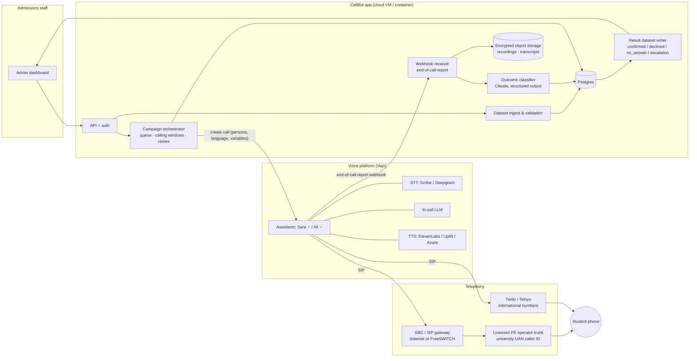
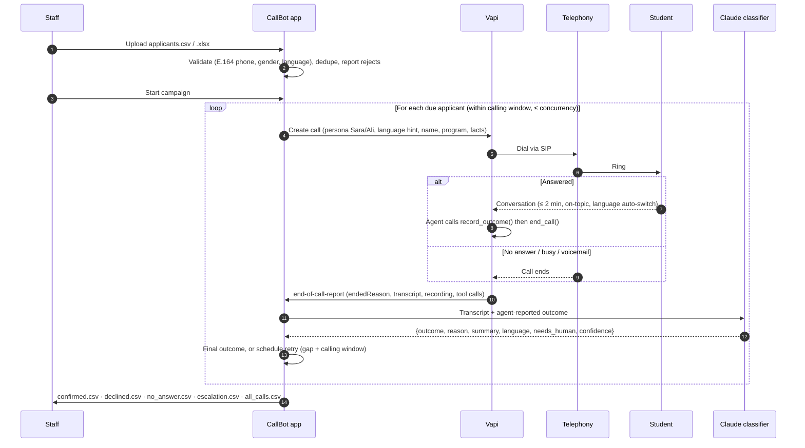
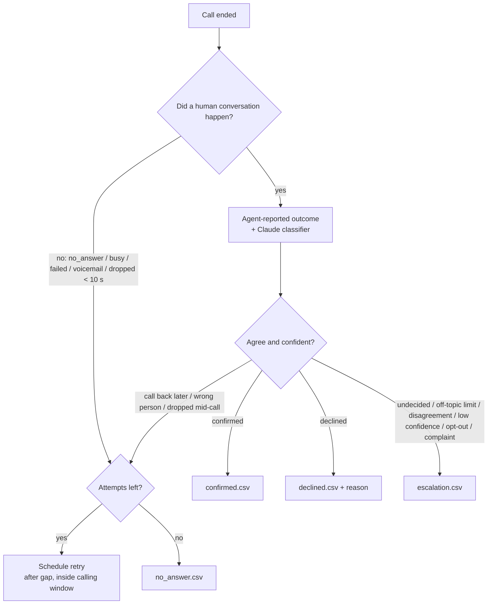

# 02 — Architecture, Tech Stack & Data Flow

## 1. Options compared

| | **A. Managed platform + Twilio** | **B. Managed platform + local SIP (recommended)** | **C. Fully custom** |
|---|---|---|---|
| Voice loop (STT ↔ LLM ↔ TTS, barge-in, turn-taking) | Vapi (or Retell) | Vapi (or Retell) | LiveKit Agents or Pipecat, self-hosted |
| Telephony | Twilio numbers | Local PK operator trunk via a small SBC, plus Twilio/Telnyx for international numbers | Same as B |
| Our code | Campaign orchestrator, data pipeline, classifier, dashboard | Same as A, plus SBC config | Same as B, plus the whole real-time voice pipeline |
| Cost per campaign | $5.2k | **$2.3k** | $1.7k |
| Build time to pilot | ~8 weeks | **~10 weeks** | ~16 weeks |
| Pros | Fastest. Nothing real-time to operate. Vendor handles latency, barge-in and voicemail detection | Same speed benefits as A. Local caller ID (more pickups). 55% cheaper than A | Cheapest per minute. No vendor lock-in. Full control of audio and latency |
| Cons | Foreign caller ID lowers pickup. Twilio's PK rate ($0.18/min) dominates cost | SIP/SBC setup with a Pakistani carrier needs telecom know-how. The carrier must allow AI-originated traffic | Hardest to build and run: real-time audio, scaling, on-call during campaigns. Payback on the extra build cost takes 10+ campaigns |

**Decision: Option B.** Keep the code provider-agnostic behind a `VoiceProvider` interface (already in [`src/telephony/`](../src/telephony/)). That leaves a path to move to C later if volume grows (for example, several universities or year-round campaigns).

Why not Bland? It's cheaper for English, but its Urdu/regional-language support and voice choice were weaker when this was written. We can re-evaluate it in the Phase 0 bake-off.

## 2. System diagram (Option B)

## 3. Tech stack

| Layer | Choice | Why |
|---|---|---|
| Language/runtime | **Node.js 22+ / TypeScript** | Team preference. First-class SDKs for Vapi, Retell, LiveKit and Anthropic |
| Voice platform | **Vapi** (Retell as fallback) | Outbound campaigns API (up to 10k contacts), BYO SIP trunk, per-call assistant overrides, end-of-call webhooks |
| STT | **ElevenLabs Scribe v2 Realtime** or **Deepgram Nova-3 Multilingual** | Both support streaming Urdu. Scribe covers Punjabi/Sindhi/Pashto. Pick one in the Phase 0 bake-off |
| TTS | **ElevenLabs Flash** (default), **Uplift AI** (Urdu/regional candidate), **Azure Neural** (budget) | One female and one male voice per language |
| In-call LLM | Fast model with low time-to-first-token (base estimate: Claude Haiku 4.5) | Chosen by latency in the bake-off. Configured in the Vapi assistant |
| Post-call classifier | **Claude** via `@anthropic-ai/sdk` with structured output (`CLASSIFIER_MODEL`, default `claude-opus-5`) | Reliable JSON outcome + reason + summary in any language |
| Telephony | Licensed PK operator SIP trunk + **Asterisk/FreeSWITCH** SBC. Twilio/Telnyx for non-PK numbers | Local caller ID, lowest rate, PTA-compliant routing |
| Database | **PostgreSQL** | Campaigns, applicants, attempts, outcomes. Transactional retry queue (`SELECT … FOR UPDATE SKIP LOCKED`) |
| Queue | Postgres-backed (Phase 3). BullMQ/Redis only if needed | Fewer moving parts at 15k calls/campaign |
| Storage | S3-compatible object storage, server-side encryption | Recordings and transcripts, with a retention policy |
| Dashboard | React (Vite) + the same API | Upload, start/pause, live progress, downloads |
| Hosting | One small cloud VM or container service + managed Postgres | Nothing on-prem. Workload is ~30 line-hours per campaign |
| CI | GitHub Actions: typecheck + tests | Already in `.github/workflows/ci.yml` |

## 4. Data flow

### Outcome decision

## 5. Module map (code)

| Module | Path | Phase | Status |
|---|---|---|---|
| Dataset ingest (CSV/XLSX, phone normalization, dedupe) | `src/ingest/` | 3 | ✅ skeleton + tests |
| Persona selection (Sara/Ali, voice per language) | `src/persona/` | 2 | ✅ |
| Config (campaign, personas, voice stack) with validation | `src/config.ts`, `config/` | 1 | ✅ |
| Vapi adapter: assistants, calls, end-of-call parsing, webhook server | `src/telephony/vapi/` | 1 | ✅ tested. Live check pending |
| Durable call store | `src/store/` | 1 | ✅ JSONL. Postgres in Phase 3 |
| SBC (Asterisk) for the Pakistani trunk | `telephony/sbc/` | 1 | ✅ templates. Deploy pending carrier |
| Languages + opening lines (7 languages, gendered) | `src/language/` | 2 | ✅ drafts, need native review |
| System prompt builder | `src/prompts/` + `prompts/` | 2 | ✅ |
| Calling windows + retry policy | `src/campaign/retryPolicy.ts` | 3 | ✅ |
| Campaign runner (queue, concurrency, retries) | `src/campaign/campaignRunner.ts` | 3 | ✅ in-memory. Postgres in Phase 3 |
| Voice provider interface + mock | `src/telephony/` | 1 | ✅ |
| Outcome classification (agent + Claude) | `src/classify/` | 3 | ✅ |
| Result dataset writer | `src/output/` | 3 | ✅ |
| Cost model | `src/cost/` | 0 | ✅ |
| Admin dashboard | `dashboard/` | 4 | ⏳ |

## 6. Scaling and reliability

- **Throughput.** 10 concurrent lines give about 600 connected calls per hour, so the first pass finishes in about 1.5 working days. Concurrency is a config value (`maxConcurrency`) and is also capped by the Vapi plan.
- **Idempotency.** Each attempt has a deterministic key `campaignId:applicantId:attemptNo`. Webhooks are upserted by call ID, so a duplicated webhook never creates a duplicate record. If call creation times out, look the call up before retrying so the student is never dialled twice.
- **Pause/resume.** Campaign state lives in Postgres, so the orchestrator can restart at any time. Pausing stops new dials and lets in-flight calls finish.
- **Kill switch.** One API call or dashboard button stops all dialling immediately. It's required for the pilot.
- **Monitoring.** Per-minute counters (dialled, connected, outcomes, average duration, error reasons) on the dashboard. Alert if the connect rate drops below 30% (carrier blocking or a caller-ID problem).
