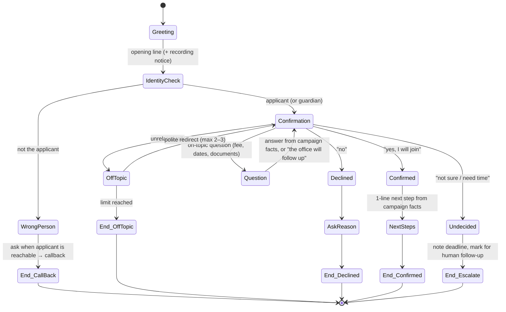

# 03 — Conversation Design & Call Script

## 1. Goals of every call

1. Reach the **right person** (the applicant, or a parent/guardian if the applicant is a minor or the parent answers).
2. Get a **clear answer**: *Will you take admission in {program}?* → yes / no / not sure yet.
3. If **no**, capture the **reason** in a few words.
4. Finish in **60–120 seconds**, stay on topic, and leave a good impression of the university.

## 2. Personas

| Student gender | Persona | Voice | Grammar notes |
|---|---|---|---|
| Female | **Sara**, admissions office | Female voice per language | Urdu/Hindi/Punjabi/Sindhi verbs use the feminine form ("bol rahi hoon") |
| Male | **Ali**, admissions office | Male voice per language | Masculine verbs ("bol raha hoon") |
| Unknown / other | Configurable default (`defaultPersonaWhenUnknown`, default **Sara**) | | |

Personas never claim to be a specific real staff member, give a surname, or claim to be human. See §6.

## 3. Call flow

**Time discipline**
- Soft limit at **90 s**: the agent moves to wrap-up.
- Hard limit at **120 s** (`maxDurationSeconds`): the platform ends the call. If no clear answer was recorded, the outcome is `escalation / time_limit`.
- Silence of more than 8 s → one prompt ("Are you there?"). A second silence → end the call as `dropped` (retryable).

## 4. Sample script (English, persona Sara)

> Translations for the other languages are generated live by the LLM. Only the **opening line** is pre-written per language (see `src/language/languages.ts`), so the first words are always correct and approved.

| Step | Agent says | Notes |
|---|---|---|
| Opening | "Assalam-o-Alaikum, this is Sara from the admissions office at {University}. Am I speaking with {Student}? This call is recorded for quality purposes." | Opening line is spoken in the preferred language if known, otherwise Urdu (configurable) |
| Identity ✔ | "Congratulations on your admission to {Program}! I'm calling to confirm: will you be taking admission this semester?" | |
| Yes | "Wonderful! Just to confirm, you will join {Program}. {next_step_fact}. Thank you, and welcome to {University}!" | Calls `record_outcome(confirmed)` → `end_call` |
| No | "Thank you for letting us know. May I ask the main reason, so we can improve?" → "Thank you. We wish you the best." | Record the reason as the student said it (short). Don't argue or persuade |
| Not sure | "No problem. The deadline to confirm is {deadline}. Someone from the office may follow up with you. Thank you!" | `escalation / undecided` |
| On-topic question | Answer only from **campaign facts**. If a fact isn't listed: "I'll ask the office to get back to you on that." | Never invent fees, dates or policies |
| Off-topic (1st, 2nd) | "I understand. I'm only able to help with your admission confirmation today. Will you be taking admission in {Program}?" | Counter +1 |
| Off-topic (limit) | "I'll let you go now. The admissions office will contact you again. Thank you!" | `escalation / off_topic_limit` |
| Wrong person | "Could you tell me a good time to reach {Student}?" | `callback_requested` (retryable) |
| "Are you a bot?" (sincere) | "Yes, I'm an automated assistant calling on behalf of the {University} admissions office. I can note your answer, or a staff member can call you back if you prefer." | Answer honestly, then continue. If they want a human → `escalation / human_requested` |
| "Don't call me again" | "Understood, we won't call you again about this. Thank you." | `escalation / opted_out`. Never retried |

## 5. Language detection & switching

1. **Before the call:** use the dataset's `preferred_language` if present. Otherwise use `defaultLanguage` (Urdu) for PK numbers and English for others.
2. **During the call:** the STT runs in multilingual/auto-detect mode. The system prompt tells the agent to **reply in the language the student speaks**, switch whenever the student switches, and allow Urdu–English code-mixing as Pakistanis naturally speak.
3. **Voice follows language:** each persona has one voice per language (`config/personas.json`). On Vapi this is a voice-per-language setting or a mid-call assistant handoff (squad). This is chosen in Phase 1.
4. **Unsupported language** (for example Balochi or Saraiki when the TTS can't produce it): switch to Urdu and say so politely. If the student still can't continue → `escalation / language_unsupported` for a human caller who speaks it.
5. The language actually used is recorded in `language_used`.

| Language | STT | TTS | Status |
|---|---|---|---|
| Urdu | ✅ strong | ✅ strong | Launch |
| English | ✅ | ✅ | Launch |
| Punjabi (Shahmukhi) | ✅ good | ⚠️ verify voice quality | Launch after native test |
| Sindhi | ✅ good | ⚠️ verify | Launch after native test |
| Pashto | ⚠️ moderate | ⚠️ verify | Pilot, human fallback |
| Arabic | ✅ | ✅ | Launch |
| Hindi | ✅ | ✅ | Launch |
| Saraiki, Balochi, Hindko | ⚠️ limited | ❌ mostly | Human fallback via escalation |

## 6. AI disclosure policy

The requirement: the bot doesn't volunteer that it is AI, but answers honestly when sincerely asked. This is implemented as a **configurable, per-region policy** (`disclosure` in `config/campaign.example.json`):

| Mode | Behaviour | Default for |
|---|---|---|
| `on_ask` | Never claims to be human. Honestly confirms it is an automated assistant when asked, then continues | Pakistan (+92) |
| `upfront` | Opening line includes "I'm an automated assistant from the admissions office" | **EU/EEA numbers (required by EU AI Act Art. 50 since 2 Aug 2026)**, UK, US, and any country your legal review flags |

In **both** modes the agent must **never deny being AI** and must never claim to be a human staff member. A **recording notice** is spoken on every call. See [06-legal-compliance.md](06-legal-compliance.md).

> Recommendation: consider `upfront` everywhere. It costs about 2 seconds and protects the university's reputation if a call recording is shared on social media. The final choice belongs to the university's legal/communications office.

## 7. Outcome taxonomy

| Final file | `outcome` | `sub_outcome` values |
|---|---|---|
| `confirmed.csv` | `confirmed` | `confirmed` |
| `declined.csv` | `declined` | `declined` (+ `reason`: fee, other university, program change, personal/family, relocation, other) |
| `no_answer.csv` | `no_answer` | `no_answer`, `busy`, `failed`, `voicemail`, `dropped` (after all attempts) |
| `escalation.csv` | `escalation` | `undecided`, `off_topic_limit`, `time_limit`, `human_requested`, `opted_out`, `wrong_number`, `language_unsupported`, `classifier_disagreement`, `low_confidence`, `complaint` |

Retryable mid-campaign: `no_answer`, `busy`, `failed`, `voicemail`, `dropped`, `callback_requested`, `wrong_person`.
