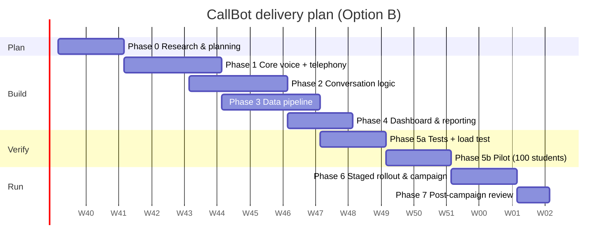

# 07 — Project Plan: Phases, Modules, Timeline

Plan for **Option B** (managed voice platform + local SIP trunk), built by a 2-person in-house team: one senior backend/voice engineer and one full-stack developer. Native-speaker reviewers and the admissions office help part-time.

**Total: about 14 weeks from kickoff to full rollout, then the 10-day campaign and a 1-week review.**

> Dates assume a **5 October 2026** kickoff. Shift them to finish at least **two weeks before** the admission-confirmation window opens.

---

## Phase 0: Research & planning (2 weeks)

| Module | Work | Deliverable |
|---|---|---|
| 0.1 Requirements | Confirm fields in the admissions export, outcome definitions, calling windows, retry policy, who handles escalations | Signed requirements (this repo's docs, updated) |
| 0.2 Data audit | Take a real export (anonymised), measure invalid phones, missing gender/language, duplicates | Data-quality report + cleaning rules |
| 0.3 Provider bake-off | Record the same 15 test phrases in **Urdu, English, Punjabi, Pashto, Sindhi, Arabic, Hindi**. Score STT accuracy and TTS naturalness (native speakers, 1–5). Measure end-to-end latency. Compare Vapi vs Retell | Provider decision record: STT, TTS voices per language/gender, in-call LLM, platform |
| 0.4 Carrier quotes | Quotes from **3 licensed operators** (PTCL, Nayatel, Wateen/Multinet/Jazz Business) for a SIP trunk or PRI: per-minute rate, billing increment, channels, caller ID = university UAN, AI-calling permission | Signed carrier + final cost sheet (update `costModel.ts`) |
| 0.5 Legal check | Work through the checklist in [06-legal-compliance.md](06-legal-compliance.md) | Signed legal checklist, disclosure mode per region, consent wording |
| 0.6 Budget | Final numbers from 0.3 and 0.4 | Approved budget (USD + PKR) |

**Exit criteria:** providers chosen, carrier contract in progress, legal checklist signed.

## Phase 1: Core setup (3 weeks)

| Module | Work | Deliverable |
|---|---|---|
| 1.1 Telephony | SBC VM (Asterisk/FreeSWITCH) ↔ operator trunk. Vapi BYO SIP trunk credential. Twilio/Telnyx number for international. Caller-ID tests on Jazz, Zong, Telenor and Ufone | Outbound calls reach all 4 PK mobile networks with the university caller ID |
| 1.2 STT | Configure the chosen STT in multilingual mode. Tune endpointing (when the student has stopped talking) | Transcripts for the test phrases match the bake-off numbers |
| 1.3 TTS | Sara/Ali voices per language (`config/personas.json`). Pronunciation dictionary for the university name, program names and common Pakistani names | Voice samples approved by admissions |
| 1.4 LLM engine | Two Vapi assistants (female/male) using [`prompts/agent-system-prompt.md`](../prompts/agent-system-prompt.md). Tools `record_outcome` + `end_call`. `maxDurationSeconds = 120` | Assistant IDs in `.env` |
| 1.5 Provider adapter | `VapiVoiceProvider` (payload builder exists), webhook receiver with auth, idempotent storage of end-of-call reports | Call a staff phone from the CLI. The transcript and recording are saved |

**Exit criteria:** 20 test calls to staff phones in Urdu + English, 100% webhook capture, median response latency under 1.2 s.

## Phase 2: Conversation logic (3 weeks, overlaps Phase 3)

| Module | Work | Deliverable |
|---|---|---|
| 2.1 Script | Implement the flow in [03-conversation-design.md](03-conversation-design.md). Pre-written opening lines per language (native-reviewed) | Approved script in 7 languages |
| 2.2 Persona | Gender → Sara/Ali, grammar, voice. Default for unknown gender | `src/persona` + tests ✅ (skeleton done) |
| 2.3 Language | Start language from the dataset/country. Auto-switch mid-call. Fall back to Urdu for unsupported languages | Scenario tests pass for switching |
| 2.4 Off-topic handling | Redirect counter (2–3), polite exit, `off_topic_limit` | Scenario tests pass |
| 2.5 Time limits | 90 s soft wrap-up, 120 s hard stop, silence handling | Scenario tests pass |
| 2.6 Disclosure & safety | `on_ask` / `upfront` per country. Honest answer to "are you a bot?". OTP/CNIC refusal. Opt-out | Scenario tests pass |

## Phase 3: Data pipeline (3 weeks)

| Module | Work | Deliverable |
|---|---|---|
| 3.1 Dataset upload | CSV/XLSX, header aliases, E.164 normalisation, gender/language normalisation, dedupe, reject report | `src/ingest` ✅ (skeleton done) |
| 3.2 Database | Postgres schema: campaigns, applicants, attempts, outcomes, audit log | Migrations |
| 3.3 Orchestrator | Queue with concurrency limit, calling windows by recipient time zone, pause/resume, kill switch | `src/campaign` ✅ in-memory → Postgres |
| 3.4 Retry queue | Configurable attempts and gaps. Retryable end reasons. Callback-time handling | ✅ policy done. Persistence in 3.2 |
| 3.5 Outcome classification | Agent-reported outcome + Claude classifier, disagreement → escalation | `src/classify` ✅ |
| 3.6 Result datasets | confirmed / declined / no_answer / escalation / all_calls CSV (+ XLSX) with the required fields | `src/output` ✅ |
| 3.7 Audit storage | Recordings/transcripts to encrypted bucket with lifecycle rules | Bucket + retention policy |

**Exit criteria:** a simulated 10,000-applicant campaign (mock provider) completes with correct counts in each file. Already possible with `npm run demo` at small scale.

## Phase 4: Admin dashboard & reporting (2 weeks)

| Module | Work | Deliverable |
|---|---|---|
| 4.1 Auth & roles | SSO or email+TOTP. Viewer/operator/admin roles | Login |
| 4.2 Upload & validate | Drag-and-drop, preview, reject report | Upload page |
| 4.3 Campaign control | Create (config form), start, pause, resume, kill switch | Campaign page |
| 4.4 Live progress | Counters (dialled, connected, per outcome), connect-rate chart, calls in progress, error reasons | Live view (polling or SSE) |
| 4.5 Results | Download each CSV/XLSX. Per-call drawer with summary, transcript and recording player (logged) | Results page |
| 4.6 Escalation workflow | Staff mark an escalation resolved with a final outcome, which updates the datasets | Escalation queue |

## Phase 5: Testing (4 weeks)

| Module | Work | Pass criteria |
|---|---|---|
| 5.1 Unit tests | Ingest, persona, retry/windows, runner, classifier merge, writer, prompt builder | ✅ running in CI. ≥ 90% coverage on `src/` |
| 5.2 Conversation tests | About 20 scenarios × 7 languages, run as text simulations (platform test suites / Vapi simulations) and as real test calls by native speakers | ≥ 95% scenarios pass. 0 cases of inventing facts or claiming to be human |
| 5.3 Classifier eval | 200 labelled transcripts from 5.2 and the pilot | ≥ 97% agreement on confirmed/declined. All disagreements escalated |
| 5.4 Load test | (a) 10,000 synthetic applicants through the orchestrator with the mock provider. (b) 300 real calls in 30 minutes to a bank of test SIMs/numbers at full concurrency | No lost webhooks, no duplicate dials, and retries scheduled correctly |
| 5.5 Pilot | **100 real students** (mixed gender, language and city), with staff listening to every call | Connect rate ≥ 60%. ≥ 90% of connected calls get a clear outcome. Complaints under 2%. Staff sign-off |
| 5.6 Go/no-go | Review pilot metrics, fix issues, re-run 5.2 | Signed go decision |

## Phase 6: Staged rollout & campaign (2 weeks)

| Step | Size | Gate to continue |
|---|---|---|
| Wave 1 | 1,000 students | Same metrics as the pilot. Escalation queue manageable |
| Wave 2 | 4,000 | No carrier blocking. Complaint rate under 2% |
| Wave 3 | Remaining ~5,000 | — |
| Retries | Automatic, per policy | — |
| Human follow-up | Staff call `escalation.csv` daily | Queue cleared by campaign end |

## Phase 7: Post-campaign review (1 week)

- Accuracy audit: staff re-check 200 random calls against the recorded outcome.
- Compare actual cost with the estimate and update `costModel.ts`.
- Compare actual enrolment with the `confirmed.csv` count (was the prediction good?).
- Retention clean-up (recordings older than 90 days deleted).
- Backlog for next season: WhatsApp pre-notice, more languages, Option C evaluation if volume grows.

## Team & responsibilities

| Role | Load | Phases |
|---|---|---|
| Senior backend/voice engineer | Full time | 0–7 (owns telephony, voice platform, orchestrator) |
| Full-stack developer | Full time from Phase 1 | 1–6 (pipeline, dashboard, tests) |
| Admissions office lead | ~20% | 0, 2, 5, 6 (script, pilot, escalations) |
| Native-speaker reviewers (Punjabi, Pashto, Sindhi, Arabic) | A few days each | 0.3, 2.1, 5.2 |
| Legal / IT security | A few days | 0.5, 5.6 |

## Risks

| Risk | Impact | Mitigation |
|---|---|---|
| Carrier refuses AI-originated calls or blocks the trunk as spam | Campaign stops | Written approval in Phase 0. Ramp volume. Twilio fallback (Option A) configured as a backup route |
| Poor Pashto/Sindhi STT/TTS quality | Wrong outcomes | Bake-off. Fall back to Urdu. Human escalation for those languages |
| Students distrust the unfamiliar caller or hang up | Low connect rate | University UAN caller ID. SMS/WhatsApp pre-notice. Short opening line |
| Bot invents facts | Reputational harm | Facts only from config. Tests with 0 tolerance. Classifier flags unanswered questions |
| Viral clip ("fake human caller") | Reputational harm | Honest disclosure policy (consider `upfront` everywhere), polite scripts, recording notice |
| Vendor outage mid-campaign | Delay | Pause/resume. There are 10 days for work that takes about 2 |
